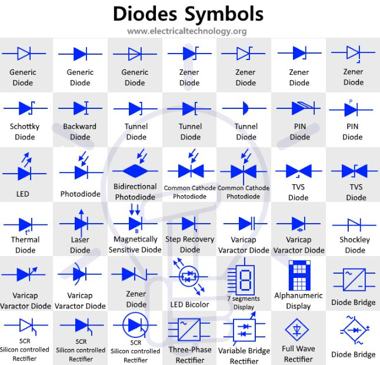

# Diodes
## Basic notes
* Electrical check valve
* Two parts, anode/cathode. On the typical symbol the cathode has the line

## Important parameters
* Bias voltage - forward voltage drop to "turn on" diode
* Reverse voltage - the maximum voltage that the diode can take onto its cathode

## Types of Diodes
* P-N Junction Diode
* Small Signal Diode
* Rectifier Diode
* Schottky Diode
* Super Barrier Diodes
* Light Emitting Diode (LED)
* Photodiode
* Laser Diode
* Tunnel Diode
* Zener Diode
* Backward Diode
* Avalanche Diode
* Transient Voltage Suppression (TVS) Diode
* Gold Doped Diode
* Constant Current Diode
* Step Recovery Diode
* Peltier Or Thermal Diode
* Vacuum Diode
* Varactor Diode
* Gunn Diode
* PIN Diode
* Silicon Controlled Rectifier (SCR)
* Shockley Diode
* Point Contact Diode

## Symbol Reference
*www.electricaltechnology.org*

